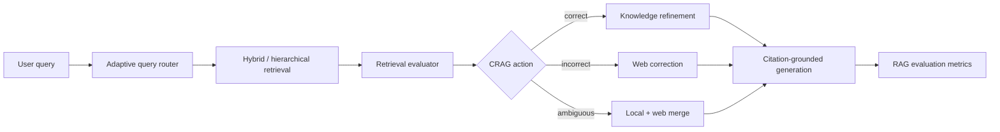

# Corrective Agentic RAG Assistant

[](https://github.com/PRINCE2-AI/corrective-agentic-rag-assistant/actions/workflows/tests.yml)
[](https://www.python.org/)
[](https://fastapi.tiangolo.com/)
[](https://streamlit.io/)
[](LICENSE)
[](https://github.com/PRINCE2-AI/corrective-agentic-rag-assistant/stargazers)

**A research-backed Adaptive CRAG system for detecting retrieval failure, correcting noisy context, falling back to web search, and measuring RAG answer quality.**

Corrective Agentic RAG Assistant turns the CRAG paper idea into a practical LLM engineering project. It routes each query by complexity, retrieves from local and hierarchical context, grades retrieval quality, chooses a corrective action, generates citation-grounded answers, and reports evaluation metrics.

> [!NOTE]
> This is an independent implementation inspired by CRAG, Adaptive-RAG, RAPTOR, ARES, and RAGAS. It is not an official implementation and is not affiliated with the paper authors.

## Why this project

Most RAG apps fail silently: they retrieve weak or irrelevant chunks, pass them into an LLM, and produce confident hallucinations. This project treats RAG as a measurable reliability system instead of a simple chatbot.

- **Retrieval quality gate:** retrieved chunks are scored before generation.
- **Corrective routing:** each query triggers `correct`, `incorrect`, or `ambiguous` behavior.
- **Adaptive retrieval depth:** simple, multi-hop, current, and long-context queries use different retrieval strategies.
- **Hierarchical context:** document and section summaries improve broad long-document questions.
- **Web fallback:** weak local retrieval can trigger Tavily search when configured.
- **Auditable output:** confidence, citations, selected chunks, filtered context, latency, and eval metrics are returned.
- **Offline coverage:** tests and demo flows run without paid APIs.

## Research mapping

| Research idea | How this project uses it |
| --- | --- |
| CRAG | Retrieval evaluator, Correct / Incorrect / Ambiguous routing, knowledge refinement, web correction |
| Adaptive-RAG | Query complexity router for simple, multi-hop, web-needed, and long-context questions |
| RAPTOR | Document-level and section-level summary chunks for long-context retrieval |
| ARES / RAGAS | Context relevance, answer faithfulness, answer relevance, citation coverage, and latency metrics |

## Architecture



The system returns one response only after these checks:

```text
retrieval_score -> crag_action -> refined_context -> grounded_answer -> eval_metrics
```

## Quick start

### 1. Clone and install

```bash
git clone https://github.com/PRINCE2-AI/corrective-agentic-rag-assistant.git
cd corrective-agentic-rag-assistant
python -m venv .venv
```

Windows PowerShell:

```powershell
.\.venv\Scripts\Activate.ps1
pip install -r requirements.txt
Copy-Item .env.example .env
```

macOS/Linux:

```bash
source .venv/bin/activate
pip install -r requirements.txt
cp .env.example .env
```

### 2. Optional model and search configuration

Edit `.env` if you want live generation or web correction:

```env
OLLAMA_BASE_URL=http://localhost:11434
OLLAMA_MODEL=mistral
TAVILY_API_KEY=
DEFAULT_TOP_K=5
CRAG_UPPER_THRESHOLD=0.5
CRAG_LOWER_THRESHOLD=-0.8
```

The app still runs without Ollama or Tavily. It falls back gracefully for local demos and tests.

### 3. Run the API

```bash
uvicorn app.api:api --reload
```

Key endpoints:

| Endpoint | Purpose |
| --- | --- |
| `GET /health` | Check app and integration status |
| `POST /ingest` | Upload PDF, TXT, or Markdown files |
| `POST /query` | Run Baseline RAG, CRAG, or Adaptive CRAG |
| `POST /evaluate` | Run a batch of questions through the evaluation flow |
| `GET /metrics` | Inspect action counts, fallback rate, latency, and faithfulness |

### 4. Run the dashboard

```bash
streamlit run app/ui.py
```

Try the bundled sample document:

```text
data/sample_docs/sample_ai_notes.md
```

Suggested demo questions:

- How does CRAG handle retrieval failure?
- Compare CRAG and Adaptive-RAG for enterprise search.
- Summarize the whole document.
- What is the latest RAG paper in 2026?

## Hard run

Use retrieval failure simulation to show the corrective layer in action:

```python
from pathlib import Path

from app.graph import run_query
from app.ingestion import ingest_paths
from app.schemas import QueryRequest

ingest_paths([Path("data/sample_docs/sample_ai_notes.md")])
response = run_query(
    QueryRequest(
        question="How does CRAG handle retrieval failure?",
        simulate_bad_retrieval=True,
    )
)
print(response.action, response.confidence, response.metrics)
```

## Evaluation metrics

| Metric | Purpose |
| --- | --- |
| `context_relevance` | Measures how well selected evidence matches the query |
| `answer_faithfulness` | Estimates how much of the answer is supported by evidence |
| `answer_relevance` | Checks whether the answer addresses the question |
| `citation_coverage` | Confirms whether usable local or web sources exist |
| `latency_ms` | Tracks the cost of correction and fallback |

## Tests

The test suite is offline and does not require Ollama, Tavily, or paid APIs.

```bash
pytest -q
```

It covers:

- query complexity routing
- CRAG action selection
- knowledge-strip refinement
- bounded RAG evaluation metrics
- syntax/import smoke checks through CI

## Project layout

```text
corrective-agentic-rag-assistant/
|-- .github/                  # GitHub Actions CI
|-- app/
|   |-- api.py                 # FastAPI endpoints
|   |-- graph.py               # End-to-end CRAG workflow
|   |-- query_router.py        # Adaptive-RAG-style routing
|   |-- retrieval.py           # Hybrid / hierarchical retrieval interface
|   |-- evaluator.py           # Retrieval scoring and action routing
|   |-- refinement.py          # Knowledge-strip filtering
|   |-- hierarchical_index.py  # RAPTOR-style summaries
|   |-- generation.py          # Ollama-compatible answer generation
|   |-- rag_eval.py            # RAG quality metrics
|   `-- ui.py                  # Streamlit dashboard
|-- data/sample_docs/          # Redistributable sample input
|-- docs/                      # Architecture, paper notes, demo script
|-- tests/                     # Offline regression tests
|-- .env.example
|-- pyproject.toml
|-- requirements.txt
`-- README.md
```

## Responsible use

RAG systems can produce unsupported answers when retrieval is weak, documents are outdated, or web sources are low quality. Review citations before using outputs in production. Do not upload private, licensed, or sensitive documents without permission.

The included evaluator is a lightweight local approximation for portfolio/demo use. For production, replace it with a stronger reranker, LLM judge, human evaluation, and domain-specific benchmarks.

## Roadmap

- [ ] Add ChromaDB/Qdrant persistent vector store implementation.
- [ ] Add cross-encoder reranker for stronger retrieval grading.
- [ ] Add LangGraph-native graph nodes and state persistence.
- [ ] Add Langfuse/LangSmith trace export.
- [ ] Add benchmark CSV runner for baseline RAG vs Adaptive CRAG.
- [ ] Publish demo video and screenshots.

## Resume bullets

- Built a research-backed Adaptive CRAG system using FastAPI, Streamlit, ChromaDB-ready retrieval, Ollama, and Tavily to detect retrieval failure and dynamically route between local retrieval, hierarchical retrieval, and web correction.
- Implemented query complexity routing, Correct/Incorrect/Ambiguous retrieval actions, knowledge-strip refinement, citation-grounded generation, and RAG evaluation metrics for faithfulness and context relevance.
- Added an observability dashboard comparing baseline RAG vs Adaptive CRAG with retrieval confidence, fallback rate, filtered context, citations, latency, and answer-quality scores.

## Contributing

Contributions are welcome. Read [CONTRIBUTING.md](CONTRIBUTING.md), keep tests offline by default, and never commit API keys, private documents, or generated vector indexes.

## License

The source code is available under the [MIT License](LICENSE). Papers, datasets, and third-party services retain their own licenses and terms.

If this project helps you understand reliable RAG engineering, consider starring the repository.
