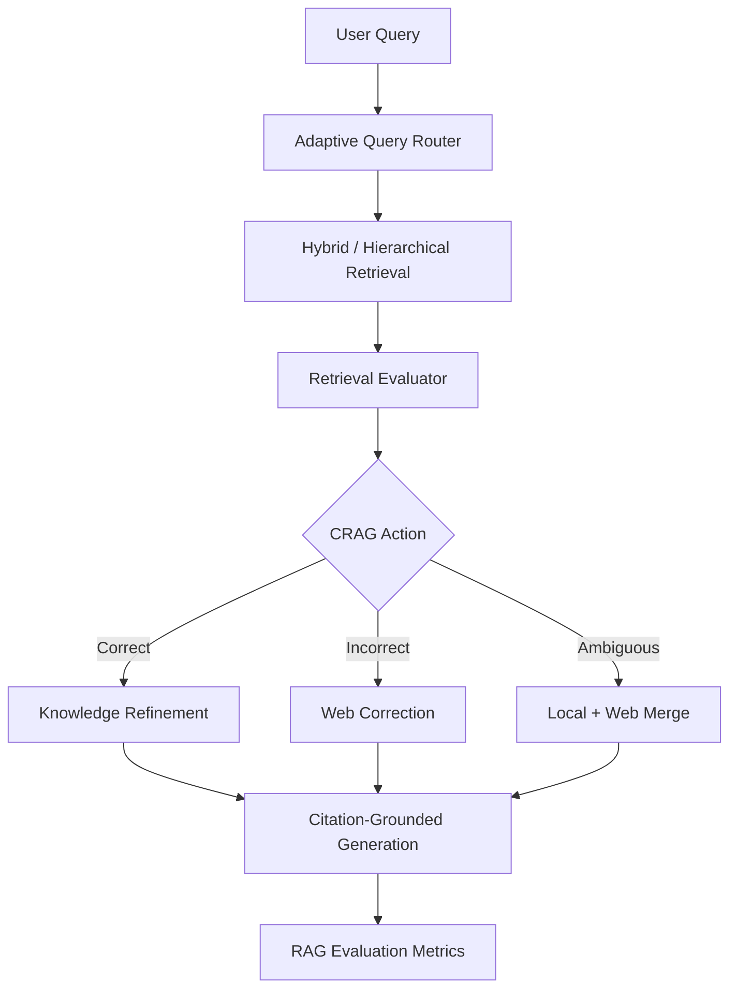

# Corrective Agentic RAG Assistant

Research-backed Adaptive CRAG assistant that detects retrieval failure, adapts retrieval depth, refines noisy context, falls back to web search, and reports RAG quality metrics.

This project is designed as a production-style LLM Engineer portfolio project, not just a notebook demo.

## Problem

Most RAG apps fail silently: they retrieve weak or irrelevant chunks, pass them into an LLM, and produce confident hallucinations.

This project adds a corrective layer before generation. It asks:

1. Is the retrieved context actually relevant?
2. Is the query simple, multi-hop, current, or long-context?
3. Should the system trust local documents, search the web, or combine both?
4. Can the final answer be evaluated for faithfulness and relevance?

## Research Used

- **CRAG**: retrieval evaluator, Correct / Incorrect / Ambiguous routing, knowledge refinement, and web correction.
- **Adaptive-RAG**: query complexity routing for simple, multi-hop, web-needed, and long-context queries.
- **RAPTOR**: hierarchical summaries for long-document retrieval.
- **ARES/RAGAS**: context relevance, answer faithfulness, answer relevance, and citation coverage evaluation.

## Architecture

```text
Query
  -> Query Complexity Router
  -> Hybrid / Hierarchical Retrieval
  -> Retrieval Evaluator
  -> CRAG Action: Correct | Incorrect | Ambiguous
  -> Knowledge Refinement and/or Web Search
  -> Citation-Grounded Generation
  -> RAG Evaluation Dashboard
```



## Features

- Upload PDF, TXT, or Markdown documents.
- Compare Baseline RAG, CRAG, and Adaptive CRAG.
- Route queries by complexity.
- Use RAPTOR-style document and section summaries for long context.
- Detect weak retrieval and trigger corrective web search.
- Show retrieval confidence, filtered chunks, web sources, citations, latency, and evaluation scores.
- Works without paid APIs using local fallbacks.
- Includes GitHub Actions tests and a typed Pydantic API contract.

## Quick Start

```bash
python -m venv .venv
.venv\Scripts\activate
pip install -r requirements.txt
copy .env.example .env
```

Run the API:

```bash
uvicorn app.api:api --reload
```

Run the UI:

```bash
streamlit run app/ui.py
```

Run tests:

```bash
pytest
```

## API

- `GET /health`: service and integration status.
- `POST /ingest`: upload files and index chunks.
- `POST /query`: run Baseline RAG, CRAG, or Adaptive CRAG.
- `POST /evaluate`: run a batch of questions through the evaluation flow.
- `GET /metrics`: inspect action counts, fallback rate, latency, and faithfulness.

## Optional Integrations

- Set `OLLAMA_MODEL=mistral` and run Ollama locally for generation.
- Set `TAVILY_API_KEY` to enable live web correction.
- Replace the lightweight lexical evaluator with a cross-encoder reranker for stronger scoring.
- Replace the in-memory retriever with ChromaDB/Qdrant for persistent vector search.

## Demo Ideas

1. Ask a question fully covered by uploaded docs. The system should choose `correct`.
2. Ask about current/latest information. Adaptive routing should mark it `web_needed`.
3. Enable retrieval failure simulation. The system should show how CRAG detects noisy context.
4. Ask a broad document-level question. Hierarchical retrieval should include summary chunks.

See `docs/demo_script.md` for a clean interview/demo walkthrough.

## Evaluation Metrics

- **Context relevance**: how well selected evidence matches the query.
- **Answer faithfulness**: how much of the answer is supported by selected evidence.
- **Answer relevance**: how well the answer addresses the query.
- **Citation coverage**: whether the answer has usable local or web sources.
- **Latency**: practical production tradeoff for correction and web fallback.

## What Makes This Strong For AI Engineering

- Shows research-to-product thinking across CRAG, Adaptive-RAG, RAPTOR, and RAG evaluation.
- Uses explicit routing and typed responses instead of hidden prompt-only logic.
- Handles missing Ollama/Tavily gracefully, so the app is demoable without paid services.
- Separates retrieval, evaluation, refinement, generation, API, and UI modules.
- Includes tests, CI, sample data, docs, and resume-ready bullets.

## Resume Bullets

- Built a research-backed Adaptive CRAG system using FastAPI, Streamlit, ChromaDB-ready retrieval, Ollama, and Tavily to detect retrieval failure and dynamically route between local retrieval, hierarchical retrieval, and web correction.
- Implemented query complexity routing, Correct/Incorrect/Ambiguous retrieval actions, knowledge-strip refinement, citation-grounded generation, and RAG evaluation metrics for faithfulness and context relevance.
- Added an observability dashboard comparing baseline RAG vs Adaptive CRAG with retrieval confidence, fallback rate, filtered context, citations, latency, and answer-quality scores.

## Limitations And Next Steps

- v1 uses a lightweight local relevance evaluator for portability.
- A stronger v2 can add a cross-encoder reranker, persistent ChromaDB/Qdrant storage, LangGraph-native graph execution, and an LLM-as-judge evaluator.
