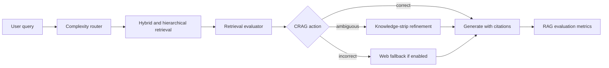

# Corrective Agentic RAG Assistant Case Study

## Problem

Basic RAG systems often fail silently: they retrieve weak context, answer with unsupported claims, and do not expose retrieval confidence. Corrective Agentic RAG Assistant makes retrieval failure visible and routes the query through correction, refinement, or fallback paths.

## Research Basis

- CRAG: classify retrieved evidence as correct, incorrect, or ambiguous.
- Adaptive-RAG: choose retrieval depth based on query complexity.
- RAPTOR: use hierarchical summaries for long-document retrieval.
- ARES / RAGAS: evaluate context relevance, answer faithfulness, and answer relevance.

## System Design

## Engineering Decisions

- Added a query router for simple, multi-hop, long-context, and web-needed queries.
- Combined vector/BM25-style retrieval ideas with hierarchical document summaries.
- Scored retrieved chunks before generation so low-quality evidence can trigger correction.
- Split retrieved content into knowledge strips and retained only the most relevant evidence.
- Made Tavily web fallback optional so the project works without paid APIs.
- Added baseline-vs-Adaptive-CRAG comparison metrics for observability.

## Evaluation Signals

| Metric | What it measures |
| --- | --- |
| Context relevance | Whether retrieved evidence matches the query |
| Answer faithfulness | Whether answer claims are supported by evidence |
| Answer relevance | Whether the final answer addresses the question |
| Citation coverage | Whether key claims have citations |
| Fallback rate | How often retrieval failure triggers correction |
| Latency | Time cost of adaptive routing and correction |

## Why It Matters For AI Engineering

This project demonstrates the reliability layer companies expect in real RAG systems: routing, retrieval quality checks, fallback logic, citation grounding, observability, and evaluation rather than a plain chatbot over documents.

## Limitations

- The evaluator is lightweight and heuristic-first, not a fine-tuned T5 evaluator.
- Web fallback depends on optional Tavily configuration.
- Scores are intended for portfolio comparison, not production-grade compliance.
- Larger benchmark sets should be added before claiming broad RAG quality gains.

## Next Improvements

- Add a 30-question benchmark set with baseline/current results.
- Add LangSmith or Langfuse traces for retrieval and generation steps.
- Add Docker Compose for API, UI, and vector database.
- Add screenshot/GIF demo for the Streamlit dashboard.
